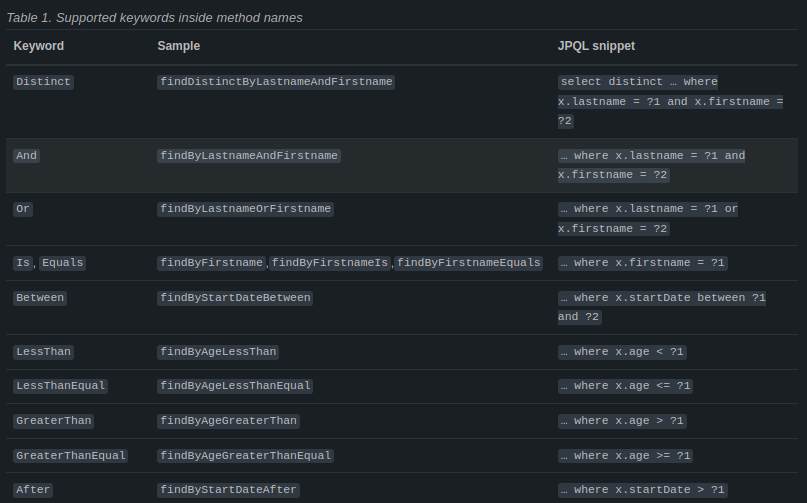

# Spring Data JPA 
Usando Spring Boot.

Adiciona uma camada sobre o JPA.

A interaçao com banco de dados será através de herança e interfaces.

## Repository Pattern
Seu objetivo é abstrair o acesso a dados de forma genérica a partir de seu modelo.
O Spring Data JPA facilita a implementação do padrão Repository através de AOP (Aspect Oriented Programin - programação orientada a aspectos).

Utilizando interfaces o Spring gera a implementação dos métodos de acesso a dados, estender a classe JpaRepository traz vários métodos genéricos de CRUD.

## Interfaces
- CrudRepository
- JPARepository
- PagingAndSortingRepository

## Anotações
- @Query
- @Param

## Principais métodos disponibilizados:
- save
- findById
- existisById
- findAll
- delete
- count


## Criando repositórios

```
@Entity
public class User {

    @Id
    @GeneratedValue(strategy = GenerationType.IDENTITY)
    @Column(name = "id")
    private Integer id;

    @Column(length = 50, nullable = false)
    private String name;

    @Column(length = 20, nullable = false)
    private String username;

    @Column(length = 100, nullable = false)
    private String password;

    public String getName() {
        return name;
    }

    public void setName(String name) {
        this.name = name;
    }

    public String getUsername() {
        return username;
    }

    public void setUsername(String username) {
        this.username = username;
    }

    public String getPassword() {
        return password;
    }

    public void setPassword(String password) {
        this.password = password;
    }

    @Override
    public String toString() {
        return "User{" +
                "id=" + id +
                ", name='" + name + '\'' +
                ", username='" + username + '\'' +
                ", password='" + password + '\'' +
                '}';
    }
}
```

```
public interface UserRepository extends JpaRepository<User, Integer> {

}
```

```
@Component  
public class StartApp implements CommandLineRunner {  
  
    @Autowired  
    private UserRepository userRepository;  
  
    @Override  
    public void run(String... args) throws Exception {  
        User user = new User();  
        user.setName("Gustavo");  
        user.setUsername("gkramer");  
        user.setPassword("123");  
  
        userRepository.save(user);  
  
        for(User u: userRepository.findAll()) {  
            System.out.println(u);  
        }  
    }  
}
```

## Consultas customizadas
Duas maneiras: **QueryMethod** e **QueryOverride**

### QueryMethod
O Spring Data JPA se encarrega de interpretar a assinatura de um método (nome + parâmetros) para montar a JPQL correspondente.

```
public interface UserRepository extends Repository<User, Log> {
	List<User> findByEmailAddressAndLastName(String emailAddres, String lastName)
}
```


### QueryOverride
Usado para querys mais avançadas.
```
public interface UserRepository extends JpaRepository<User, Integer> {
	//Query Method
	List<User> findByNameContaining(String name);

	//Query Override
	@Query("Select u FROM User u WHERE u.name LIKE %:name%")
	List<User> filtrarPorNome(@Param("name) String name);

	//Query Method
	User findByUsername(String username);
}
```
referência : [JPA Query Methods](https://docs.spring.io/spring-data/jpa/reference/jpa/query-methods.html)


